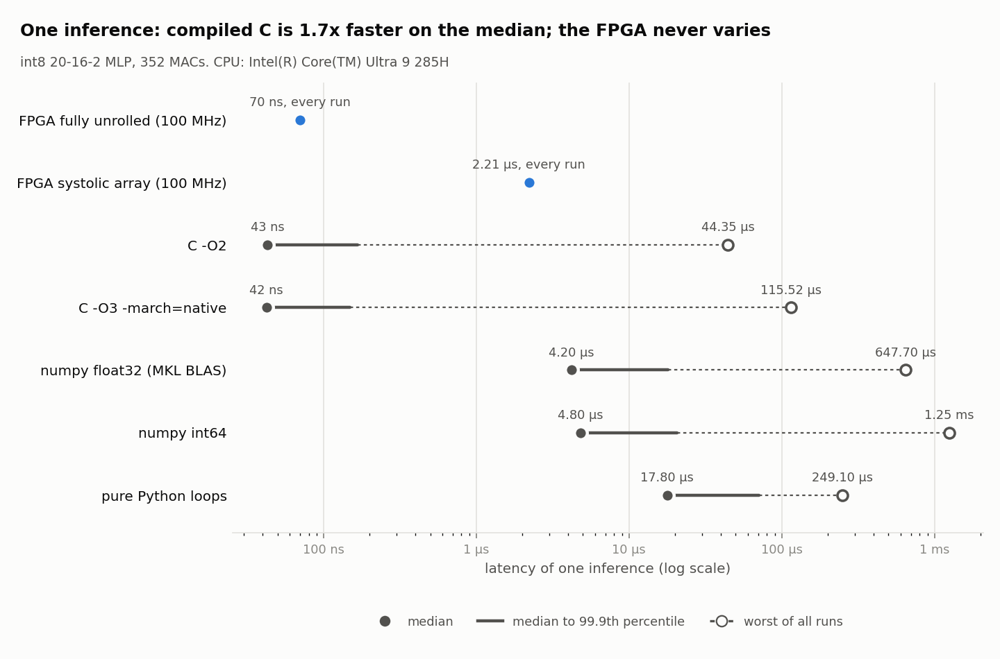

# FPGA ML Inference Accelerator

A neural network trained in Python, quantized to 8-bit integers, and run on custom
hardware on a Xilinx Artix-7 FPGA (Digilent Basys 3). The hardware gives the same
answers as the software model, bit for bit, both in simulation and on the board. It is
benchmarked against the same network running on a CPU in C, NumPy and plain Python.

There are two hardware designs for the same network:

| Engine | Idea | Latency (one inference, 100 MHz) | Logic used |
|---|---|---|---|
| **Systolic array** (`rtl/mlp.sv`) | 4×4 grid of multiply-accumulate units, reused across the network in tiles | 221 cycles = **2.21 µs** | 1,025 LUTs, 26 DSPs |
| **Fully unrolled** (`rtl/fast_mlp.sv`) | Every multiply has its own hardware, weights built in as constants, pipelined adder trees | 7 cycles = **70 ns** | 6,484 LUTs, 0 DSPs |

Both meet timing at 100 MHz on the `xc7a35tcpg236-1` and have been measured on the board.

## Results



All CPU numbers were measured on an Intel Core Ultra 9 285H. The FPGA numbers are clock
cycles counted on the chip itself, times the 10 ns clock period.

| Implementation | Median | Worst seen | Fast FPGA compared |
|---|---:|---:|---|
| **FPGA, fully unrolled** | **70 ns** | **70 ns** | — |
| FPGA, systolic array | 2.21 µs | 2.21 µs | 32× faster |
| C (`-O3 -march=native`) | 42 ns | 116 µs | C is 1.7× faster on the median |
| NumPy float32 (Intel MKL) | 4.2 µs | 648 µs | 60-90x faster |
| Pure Python | 17.8 µs | 249 µs | 254× faster |

Full table with percentiles: [results/benchmark.md](results/benchmark.md).

What the numbers say:

- **Compiled C on a CPU still wins the median, narrowly.** The CPU runs at about 5 GHz,
  50× the FPGA's 100 MHz, and a network this small (352 multiply-adds, under 1 KB of
  weights) fits entirely in its fastest cache. Counted in clock cycles, the two are close.
- **The FPGA never varies.** It takes exactly 7 cycles on every input. The CPU's worst case
  was hundreds to thousands of times its median, whenever the operating system
  interrupted it. For a latency-critical system, the worst case is what matters.
- **The FPGA is far ahead of Python and NumPy**, where interpreter and per-call overhead
  dominate at this size.
- **Power:** Vivado estimates about 0.095 W on-chip, or roughly 7 nJ per inference for the
  fully unrolled engine. This is an estimate from the tool, not a measurement. CPU power
  was not measured, so there is no energy comparison here.
- **The 70 ns is compute only.** The USB-UART round trip to the laptop is about 16 ms, mostly
  the Windows serial driver's buffering. That is why latency is counted on the chip.
  In a real low-latency system, data would come straight into the FPGA's network pins.

## The model

- **Data:** SPY (S&P 500 ETF) 1-minute bars. The inputs are the last 20 one-minute
  returns, and the label is whether the next return is up or down.
- **Network:** an MLP with 20 inputs → 16 hidden (ReLU) → 2 outputs (down/up score).
  It was trained from scratch in NumPy (`model/train.py`).
- **Quantization:** weights and inputs are int8 with a fixed-point scale of 64. Accumulation
  is 32-bit. Between layers, activations are converted back to int8 as
  `min((relu(z) + 32) >> 6, 127)`. Biases are scaled by an extra 64 to match the scale of the products.
- **Accuracy is about 50%**, which is expected: the direction of the next minute's price is
  close to random. The goal of the project is the hardware, which is judged by matching
  the software model exactly, not by prediction accuracy.

## How it works

### Systolic array (`rtl/pe.sv`, `rtl/systolic_array.sv`, `rtl/dense.sv`, `rtl/mlp.sv`)

- **`pe.sv`:** one processing element: an 8×8-bit multiply into a 32-bit accumulator,
  passing its inputs on to its right and lower neighbours. Each one maps onto a single
  DSP48 block.
- **`systolic_array.sv`:** a 4×4 grid of these. It is output-stationary: inputs flow in from
  the left, weights flow in from the top, and each PE builds up one entry of the result.
- **`dense.sv`:** one parametrized fully connected layer. It splits the output into 4×4
  tiles, streams the inputs through the array with the diagonal skew, then adds bias and
  optionally applies ReLU and requantization. The write-back step is pipelined to meet
  100 MHz.
- **`mlp.sv`:** two `dense` layers chained together.

### Fully unrolled (`rtl/fast_mlp.sv`, `rtl/adder_tree.sv`)

- **Constant multipliers.** The trained weights are loaded at synthesis time and become
  constants in the circuit, so each of the 352 multiplies is a small shift-and-add
  circuit, and all of them run in the same cycle.
- **Adder trees.** Each neuron's products are summed by a balanced adder tree
  (`adder_tree.sv`), 5 levels deep instead of a 20-long chain.
- **Pipeline depth.** A register sits after every 3 tree levels. That value came from
  synthesizing several pipeline depths:

| Registers in adder tree | Cycles | Meets 100 MHz? |
|---|---|---|
| none | 5 | no, misses by 2.6 ns |
| every 3 levels | **7** | **yes, 0.8 ns slack** |
| every 2 levels | 8 | yes |
| every level | 14 | yes |

### Board top (`rtl/top.sv`)

`top.sv` connects either engine (parameter `FAST`) to a UART link at 115200 baud:

- **Request:** the laptop sends 20 input bytes (int8).
- **Reply:** the FPGA sends 14 bytes:
  - a header that names the engine (`0xA5` systolic, `0xA6` fast)
  - the prediction
  - both scores as int32
  - the number of clock cycles the computation took, counted on the chip
- **Partial requests:** if the laptop stops partway through, the FPGA drops the partial
  request after 100 ms.
- **LEDs:** they show the last prediction, a busy light, the number of bytes received, and
  a heartbeat that blinks while the bitstream is running.

## Verification

Each step was tested against a bit-exact integer reference before moving on.

1. `model/export_reference.py` recomputes the network from the committed weights using
   exactly the hardware's integer math. It checks itself against the layer-1 reference,
   then writes the expected outputs and `$readmemh` hex files.
2. Self-checking xsim testbenches:

| Testbench | What it checks |
|---|---|
| `sim/systolic_array_tb.sv` | 4×4 array on a hand-made matrix |
| `sim/dense_tb.sv` | each layer of the systolic engine: all 80 layer-1 and 10 layer-2 values |
| `sim/mlp_tb.sv` | whole systolic network, run twice to check it restarts cleanly |
| `sim/fast_mlp_tb.sv` | fully unrolled network on all 5 test examples |
| `sim/uart_tb.sv` | UART loopback of all 256 byte values at the real baud rate |
| `sim/top_tb.sv` | full system through the UART pins, for either engine, including the timeout |

3. On the board, `host/run.py` sends the test examples and checks every reply.

## Repository layout

```
rtl/          SystemVerilog design (both engines, UART, board top)
sim/          self-checking testbenches
constraints/  Basys 3 pin assignments
scripts/      build.tcl: one-command bitstream build
model/        training, reference generation, frozen int8 weights and hex files
host/         laptop side: run.py (board test), benchmark.py, bench_cpu.c
results/      benchmark table, JSON and chart
```

## Running it

Requirements: Vivado 2025.2 (or similar), Python 3 with `numpy`, `matplotlib` and
`pyserial`, and gcc for the C baseline. A Basys 3 board is needed for the on-board steps.

**Regenerate the reference files** (optional, they are committed):

```
python model/export_reference.py
```

Do not re-run `model/train.py` unless you mean to retrain. It downloads fresh market
data, so it would produce a different model from the one the hardware is verified against.

**Simulate.** Run from the repo root in a Vivado Tcl shell. The testbenches load the hex
files by relative path. `--timescale` is needed because the RTL files do not declare one.

```
exec xvlog -sv rtl/adder_tree.sv rtl/fast_mlp.sv sim/fast_mlp_tb.sv
exec xelab fast_mlp_tb -s fast --timescale 1ns/1ps
exec xsim fast -R
```

Expect `FAST MLP PASS`. The other testbenches work the same way; `top_tb` needs every
file in `rtl/`.

**Build a bitstream.** This takes a few minutes. Output goes to `build/<engine>/top.bit`.

```
vivado -mode batch -source scripts/build.tcl                     # fully unrolled (default)
vivado -mode batch -source scripts/build.tcl -tclargs systolic   # systolic array
```

**Run on the board:**

1. Program `build/fast/top.bit` or `build/systolic/top.bit` from Vivado's Hardware Manager.
2. Close Hardware Manager, then run:

```
python host/run.py               # prints the engine, checks all 5 examples, expect BOARD PASS
python host/benchmark.py COM5    # full benchmark, using the board's live cycle counts
```

`benchmark.py` without a port runs only the CPU side and uses the last known FPGA cycle
counts.

## Next steps

The project is complete as it stands. These would extend it:

- **Throughput test.** The fully unrolled engine is a pipeline and can accept a new input
  every clock cycle, up to 100 million inferences per second. Streaming inputs back to back
  on the chip and counting completions would turn that into a measured number, compared
  against a single CPU core.
- **Lower-precision weights.** Retraining with ternary (−1/0/+1) or 4-bit weights turns each
  multiply into an add, a subtract or nothing. The logic gets shallower and smaller, which
  could reduce the latency to about 3–4 cycles (30–40 ns), close to or below the C median.
- **Higher clock.** The board's 100 MHz could be multiplied to 150–200 MHz with the FPGA's
  clock manager and a deeper pipeline. This is likely a modest gain.
- **A recognized benchmark dataset.** The LHC jet-tagging dataset (16 features, 5 classes)
  is the standard benchmark for low-latency FPGA neural networks. A model of the same size
  would fit the unrolled engine and give a task with meaningful accuracy.
- **Bigger models.** At about 18 LUTs per multiply-add, the unrolled design tops out around
  1,000 multiply-adds on this chip. Larger models would need a hybrid of the two engines, or a larger FPGA.
- **Energy comparison.** Measure board and CPU power under load, so ops-per-watt can be
  compared with real numbers.

## Authors

Griffin Charlson and Jackson France.
